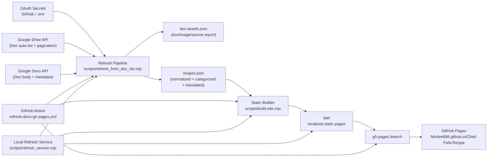

# Chef Fafa's Recipe Website

Modern static recipe site with:

- Multilingual pages: English (`/en`), Traditional Chinese (`/zh-Hant`), Japanese (`/ja`)
- Dark/light mode toggle with saved user preference
- Search-friendly recipe pages with clean URLs and `hreflang`
- Auto-categorized cuisines and recipe types from recipe content
- Google Doc image extraction into local site assets
- Structured data (`schema.org/Recipe`), sitemap, and robots
- Backend refresh service for automatic Google Doc sync

## Latest Updates (March 2026)

- Brand/content naming standardized to **Chef Fafa's Recipe**
- Dark/light mode fully integrated in generated pages with:
  - system preference fallback (`prefers-color-scheme`)
  - persisted user choice (`localStorage` key: `chief_fafa_theme`)
  - localized toggle labels (EN / 繁中 / 日本語)
- Enquiry and recipe content pipeline aligned with Chef Fafa Bot naming and shared Google Docs env keys
- Refresh workflow supports scheduled auto-refresh from Google Docs and publish to `gh-pages`

## Project Structure

- `scripts/import-google-doc.mjs`: Single-doc importer/parser with image extraction.
- `scripts/refresh_from_doc_ids.mjs`: Batch extract images + original URLs from Google Docs (auto-discovered via Drive API with full pagination; supports explicit Doc ID override).
- `scripts/build-site.mjs`: Builds multilingual static website into `site/`.
- `scripts/refresh_service.mjs`: Backend HTTP service with auto-refresh scheduler.
- `data/doc-assets.json`: Extracted doc/image/source-url report.
- `data/recipes.json`: Parsed recipe data used by the site builder.
- `static/assets/*`: Frontend JS/CSS and extracted recipe images.
- `site/*`: Generated static website output.

## Infrastructure Diagram



## One-Time Manual Refresh

```bash
npm run refresh
npm run build
npm run start
```

This serves the generated site at `http://127.0.0.1:8080`.

## Frontend Theme Behavior

- Initial theme is set before render via inline boot script to reduce theme flash.
- If no saved preference exists, the site follows system theme.
- Theme toggle updates `data-theme` on `<html>` and persists preference for next visits.

## Backend Service (Automatic Refresh)

Run the service:

```bash
npm run service
```

Default behavior:

- Listens on `http://127.0.0.1:8789`
- Runs refresh on startup
- Auto-runs refresh every 30 minutes
- Serves the generated website directly from `site/`

### Service API

- `GET /api/health` or `GET /api/status`: current state, last run, next run, recent logs
- `POST /api/refresh`: trigger immediate refresh (also accepts `GET`)
- `GET /api/logs`: recent service logs

### Optional Environment Variables

- `RECIPE_SERVICE_HOST` (default `127.0.0.1`)
- `RECIPE_SERVICE_PORT` (default `8789`)
- `RECIPE_REFRESH_INTERVAL_MINUTES` (default `30`)
- `RECIPE_AUTO_REFRESH` (`1` or `0`, default `1`)
- `RECIPE_RUN_ON_START` (`1` or `0`, default `1`)
- `RECIPE_SERVICE_TOKEN` (if set, required for `/api/refresh` and `/api/logs` via `x-service-token` header or `?token=`)
- `RECIPE_DOC_IDS` (comma-separated override list)
- `RECIPE_ENV_FILE` (custom `.env` path)
- `GOOGLE_DOCS_DRIVE_QUERY` (optional Drive API query override; default is all non-trashed Google Docs)
- `GOOGLE_DOCS_MAX_DOCS` (optional limit, useful for testing)
- `GOOGLE_DOCS_DRIVE_PAGE_SIZE` (optional page size for Drive listing, default `200`)
- `RECIPE_TRANSLATE_ENABLED` (`1` or `0`, default `1`)
- `RECIPE_TRANSLATE_MODEL` (default `gpt-4.1-mini`)
- `RECIPE_OCR_MODEL` (default: same as `RECIPE_TRANSLATE_MODEL`)
- `SITE_BASE_PATH` (for subpath deploys, e.g. `/Chief-Fafa-Recipe`)

## Google Docs OAuth Env

Private doc access uses the same env naming as ChiefFaFaBot:

- `GOOGLE_DOCS_CLIENT_ID`
- `GOOGLE_DOCS_CLIENT_SECRET`
- `GOOGLE_DOCS_REFRESH_TOKEN`
- `GOOGLE_DOCS_ACCESS_TOKEN` (optional fallback)

Recommended OAuth scopes for full auto-discovery:

- `https://www.googleapis.com/auth/documents.readonly`
- `https://www.googleapis.com/auth/drive.metadata.readonly`

The scripts automatically check env from:

- `/Users/felixlee/Documents/ChiefFaFaBot/.env`
- `.env` in this project

To override this lookup order, set `RECIPE_ENV_FILE` (or pass `--env-file`).

## GitHub Pages Deployment

This project includes a GitHub Actions workflow at `.github/workflows/deploy-pages.yml`.

After pushing this repository to GitHub on the `main` branch:

1. Open repo `Settings` -> `Pages`
2. Set `Source` to `GitHub Actions`
3. Push to `main` (or re-run the workflow)

The workflow builds the static site with `node scripts/build-site.mjs` and publishes the generated `site/` folder.

## Trigger Refresh on GitHub

For GitHub Pages branch-based deployment (`gh-pages`), use:

- `.github/workflows/refresh-docs-gh-pages.yml`

This workflow:

1. Pulls latest content/images from Google Docs
2. Rebuilds the site with the repository base path
3. Force-pushes the output to `gh-pages`

### One-time GitHub Secrets Setup

In `Settings` -> `Secrets and variables` -> `Actions`, add:

- `GOOGLE_DOCS_CLIENT_ID`
- `GOOGLE_DOCS_CLIENT_SECRET`
- `GOOGLE_DOCS_REFRESH_TOKEN`
- `GOOGLE_DOCS_ACCESS_TOKEN` (optional fallback)
- `OPENAI_API_KEY` (optional but recommended for EN/ZH/JA recipe translation)

Alternative legacy names are also supported:

- `GOOGLE_KEEP_CLIENT_ID`
- `GOOGLE_KEEP_CLIENT_SECRET`
- `GOOGLE_KEEP_REFRESH_TOKEN`
- `GOOGLE_KEEP_ACCESS_TOKEN` (optional fallback)

### Manual Trigger

Open `Actions` -> `Refresh Docs and Publish` -> `Run workflow`.

Optional input:

- `doc_ids`: comma-separated doc IDs override for one run.
